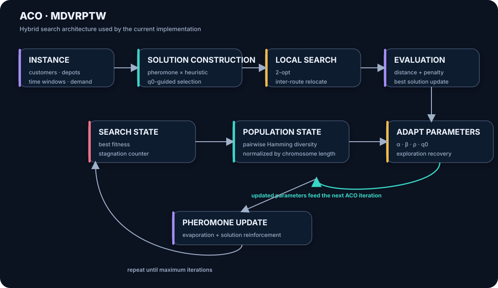
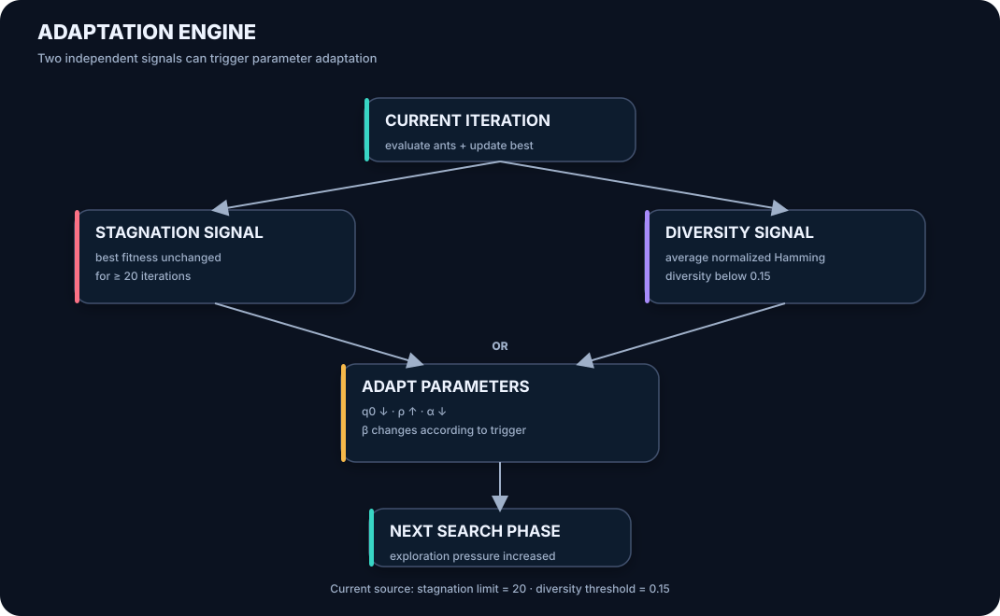
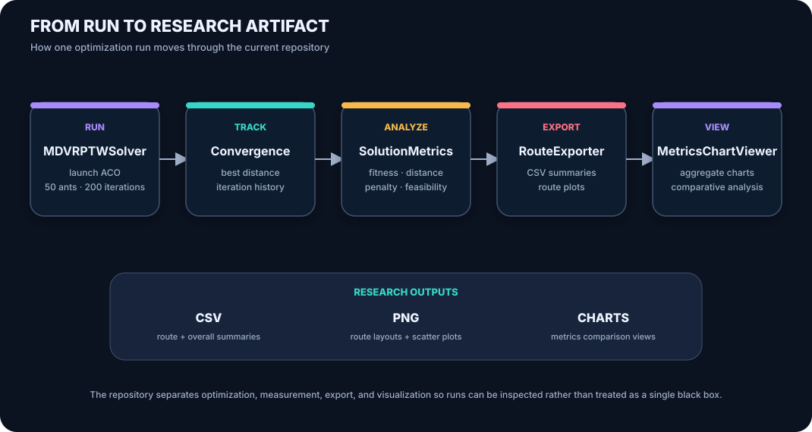

# MDVRP-TW-ACO

**Ant Colony Optimization for the Multi-Depot Vehicle Routing Problem with Time Windows (MDVRPTW)**

A Java/JavaFX research implementation of Ant Colony Optimization (ACO) for solving the Multi-Depot Vehicle Routing Problem with Time Windows (MDVRPTW). The project investigates hybrid local search, adaptive parameter control, and diversity preservation within an ACO framework.

The implementation accompanies research on adaptive and diversity-driven ACO variants for MDVRPTW.

---

## Research Context

The **Multi-Depot Vehicle Routing Problem with Time Windows (MDVRPTW)** is a constrained combinatorial optimization problem involving:

* Multiple depots
* Multiple customer locations
* Vehicle capacity constraints
* Customer service time windows
* Route-distance minimization
* Feasibility and penalty management

Classical ACO can suffer from premature convergence and excessive exploitation of early solutions. This implementation therefore extends the basic ACO framework with three complementary mechanisms:

1. **Local Search**
2. **Adaptive Parameter Control**
3. **Solution Diversity Preservation**

The resulting framework supports experimentation with different combinations of exploration, exploitation, intensification, and diversification.

---

## Research Architecture

<p align="center">
  
</p>

The solver combines pheromone-guided solution construction with heuristic information, local improvement, adaptive parameter control, diversity monitoring, and pheromone updating.

---

## ACO Components

### 1. Ant Solution Construction

Each ant constructs a candidate MDVRPTW solution using:

* Pheromone information
* Heuristic information
* Distance
* Vehicle capacity feasibility
* Customer time-window compatibility

The transition mechanism balances pheromone influence and problem-specific heuristic information.

---

### 2. Local Search

Candidate solutions can undergo local improvement using:

* **Intra-route 2-opt**
* **Inter-route relocate**

The local search stage provides intensification by improving the routes generated during ant construction.

The relocate procedure can perform multiple refinement rounds to further improve feasible or penalized solutions.

---

### 3. Adaptive Parameter Control

The implementation dynamically adjusts the principal ACO parameters when the search exhibits stagnation or insufficient diversity.

The monitored parameters include:

* `alpha` — pheromone influence
* `beta` — heuristic influence
* `rho` — pheromone evaporation
* `q0` — exploitation/exploration control

<p align="center">
  
</p>

Two adaptation mechanisms are implemented:

#### Stagnation Adaptation

When the best solution does not improve for a predefined number of iterations:

* `q0` is reduced
* `rho` is increased
* `alpha` is reduced
* `beta` is increased

This encourages greater exploration and reduces excessive reliance on established pheromone trails.

#### Diversity Adaptation

Solution diversity is estimated using normalized pairwise Hamming distance.

When diversity falls below the specified threshold:

* `q0` is reduced
* `rho` is increased
* `alpha` is reduced
* `beta` is adjusted to encourage alternative search behaviour

---

## Research Pipeline

<p align="center">
  
</p>

The overall research workflow is:

```text
MDVRPTW Instance
       │
       ▼
Data Loading
       │
       ▼
Ant Solution Construction
       │
       ▼
Local Search
       │
       ▼
Solution Evaluation
       │
       ├───────────────┐
       ▼               ▼
Stagnation         Diversity
Detection          Monitoring
       │               │
       └───────┬───────┘
               ▼
       Parameter Adaptation
               │
               ▼
       Pheromone Update
               │
               ▼
        Next ACO Iteration
               │
               ▼
        Best Solution
               │
               ▼
       Metrics & Visualisation
```

---

## Current Software Configuration

The current repository implementation uses the following default configuration:

| Parameter                     | Current Value |
| ----------------------------- | ------------: |
| Number of ants                |            50 |
| Maximum iterations            |           200 |
| Alpha (`α`)                   |           1.0 |
| Beta (`β`)                    |           2.0 |
| Evaporation (`ρ`)             |           0.5 |
| Exploitation threshold (`q0`) |           0.9 |
| Stagnation limit              |            20 |
| Diversity threshold           |          0.15 |
| Initial pheromone             |           1.0 |

The implementation should be regarded as an actively configurable research codebase rather than a strict reproduction of every parameter used in the published experiments.

---

## Published Experimental Configuration

The associated research paper used the following experimental configuration:

| Parameter                     | Published Setting |
| ----------------------------- | ----------------: |
| Alpha (`α`)                   |               1.0 |
| Beta (`β`)                    |               2.0 |
| Evaporation (`ρ`)             |               0.1 |
| Exploitation threshold (`q0`) |               0.9 |
| Number of ants                |                20 |
| Maximum iterations            |               100 |
| Stagnation limit              |                10 |
| Diversity threshold           |               0.2 |

Therefore, the current GitHub implementation and the published experimental configuration should not be assumed to be numerically identical.

---

## Research Findings

The associated study evaluated several ACO variants on the Cordeau MDVRPTW benchmark instances **p01–p08**.

The investigated approaches included:

* Basic Hybrid ACO with local search
* Adaptive ACO
* Diversity-driven ACO
* Hybrid adaptive + diversity-driven ACO

The study found that the mechanisms affect the search in different ways:

### Local Search

Local search provides rapid intensification and can improve solutions produced during the initial construction phase.

### Adaptive Parameter Control

Adaptive control helps the algorithm respond to stagnation and provides a mechanism for escaping overly exploitative search behaviour.

### Diversity Preservation

Diversity monitoring encourages continued exploration when the population of solutions becomes too similar.

### Hybrid Adaptation

Combining stagnation and diversity information provides a more responsive search mechanism by allowing parameter adaptation to be triggered by either search stagnation or insufficient solution diversity.

The published experiments reported maximum reductions of approximately:

* **28.5% in total distance**
* **20.3% in penalty**

for selected medium-scale benchmark instances when comparing the hybrid approach against the adaptive configuration.

These results are intended as comparative findings among the investigated ACO variants rather than a claim that the implementation universally outperforms other MDVRPTW algorithms.

---

## Features

### Core Algorithm

* Ant Colony Optimization
* Multi-depot routing
* Time-window constraints
* Capacity constraints
* Pheromone-based search
* Heuristic-guided construction
* Local search
* Adaptive parameter control
* Diversity monitoring
* Pheromone evaporation and reinforcement

### Local Search

* Intra-route 2-opt
* Inter-route relocate
* Iterative relocate refinement

### Adaptive Search

* Stagnation detection
* Diversity measurement
* Dynamic `alpha`
* Dynamic `beta`
* Dynamic `rho`
* Dynamic `q0`

### JavaFX Interface

The application provides a graphical interface for:

* Loading routing instances
* Configuring ACO parameters
* Running the solver
* Viewing routes
* Monitoring convergence
* Inspecting solution metrics
* Exporting results

---

## Input Data

The solver supports Cordeau-style routing data and flexible CSV input.

Recognized CSV fields include:

```text
id
x
y
demand
ready
due
service
type
name
maxVehicles
vehicleCapacity
depotId
```

The parser can identify:

* Depots
* Customers
* Coordinates
* Demand
* Time-window information
* Service duration
* Vehicle capacity
* Depot assignments

For customer-only CSV data without explicit depot information, a default depot can be created at `(0,0)`.

---

## Output

The solver generates routing and experiment results in several formats.

### Route Summaries

```text
results/routes_summary_YYYYMMDD_HHMMSS.csv
results/routes_summary_latest.csv
results/routes_overall_summary_YYYYMMDD_HHMMSS.csv
results/routes_overall_summary_latest.csv
```

### Route Visualisations

```text
results/plots/
```

Typical generated plots include:

```text
route_scatter_*.png
route_layout_*.png
routes_accumulated_dashboard_*.png
```

Latest versions are also generated for convenient inspection.

### Metrics

```text
metrics/summary.csv
metrics/summary_all_*.csv
metrics/run
```
